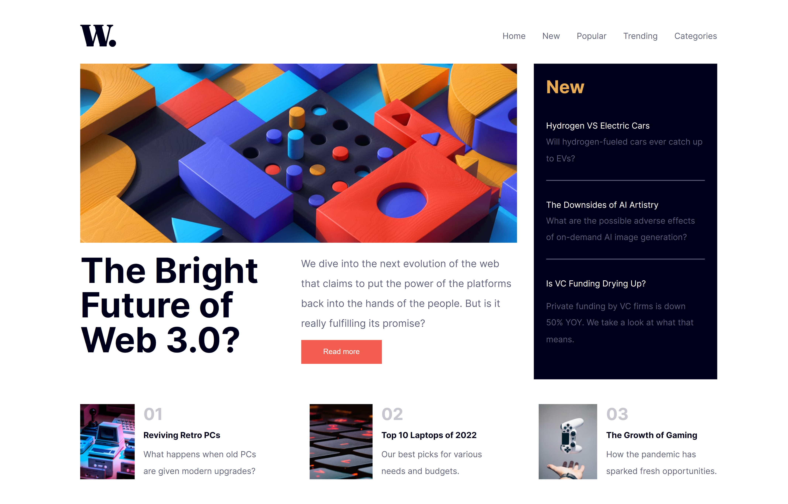

# News Homepage

This project is a responsive news homepage created as a solution to the [News homepage challenge on Frontend Mentor](https://www.frontendmentor.io/challenges/news-homepage-H6SWTa1MFl). It showcases my front-end development skills and ability to build a modern web interface.

## Table of Contents
  - [Screenshot](#screenshot)
  - [Live Demo](#live-demo)
- [My Process](#my-process)
  - [Built With](#built-with)
  - [What I Learned](#what-i-learned)
- [Author](#author)

### Screenshot

.png)
.png)
.png)

The screenshot above provides a glimpse of the project's appearance. The design is responsive, adapting to different screen sizes.

### Live Demo

You can access the live demo of the project [here](https://your-live-site-url.com).
You can access the code of the project [here](https://your-live-site-url.com).

## My Process
The project was primarily built with HTML5 and CSS3, utilizing responsive design principles to ensure it looks great on various screen sizes. JavaScript was used to enhance user interaction and functionality.

Key technologies and tools used:

- **HTML5:** The project's structure and content are built using semantic HTML tags.

- **CSS3:** Custom CSS styles were applied to create the desired layout, including responsive design elements.

- **JavaScript:** JavaScript was used to implement interactive features, such as the mobile navigation menu.

### Implementation

The project started with the creation of the HTML structure, emphasizing semantic markup to ensure accessibility and search engine optimization. 

CSS was used to style the entire page, with careful attention to detail, including typography, colors, and responsive design.

JavaScript was incorporated to provide the following functionality:

- **Mobile Navigation Menu:** A mobile-friendly navigation menu that opens and closes when the menu button is clicked, ensuring a smooth user experience on smaller screens.

### Challenges and Learnings

While working on this project, I encountered a few challenges, such as:

- **Responsive Design:** Ensuring that the layout remains visually appealing and functional across different devices required careful planning and testing.

- **JavaScript Interactions:** Implementing JavaScript interactions, particularly the mobile navigation menu, required a good understanding of event handling and DOM manipulation.

### Future Improvements

In the future, I plan to further enhance this project by:

- **Adding More Features:** Expanding the functionality to include additional features or sections, such as a search bar or user account integration.

- **Optimizing Performance:** Continuously optimizing the website's performance to ensure fast loading times, especially for users with slower internet connections.

- **Cross-Browser Compatibility:** Extending compatibility to various web browsers to ensure a consistent experience for all users.

### Built With

- HTML5
- CSS3
- Responsive design
- JavaScript (for interaction)

The project was built using modern web technologies and follows best practices in front-end development.

### What I Learned

While working on this project, I gained valuable experience in:

- Creating responsive web designs that adapt to various screen sizes.
- Implementing clean and organized HTML and CSS code.
- Enhancing user interaction through JavaScript.
- Optimizing images and other assets for web performance.

## Author

- [Anosha Sohail]
- Frontend Mentor - [@AnoshaSohail](https://www.frontendmentor.io/profile/AnoshaSohail)
Feel free to connect with me and explore more of my work!
